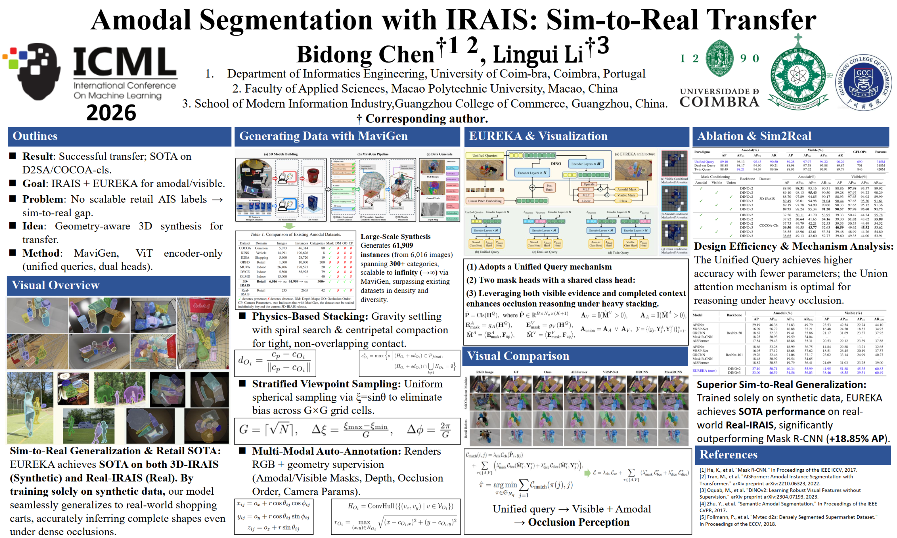
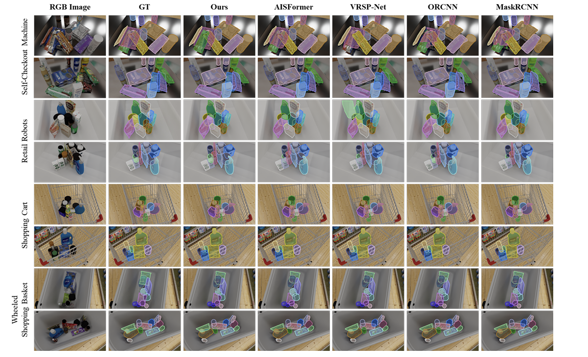
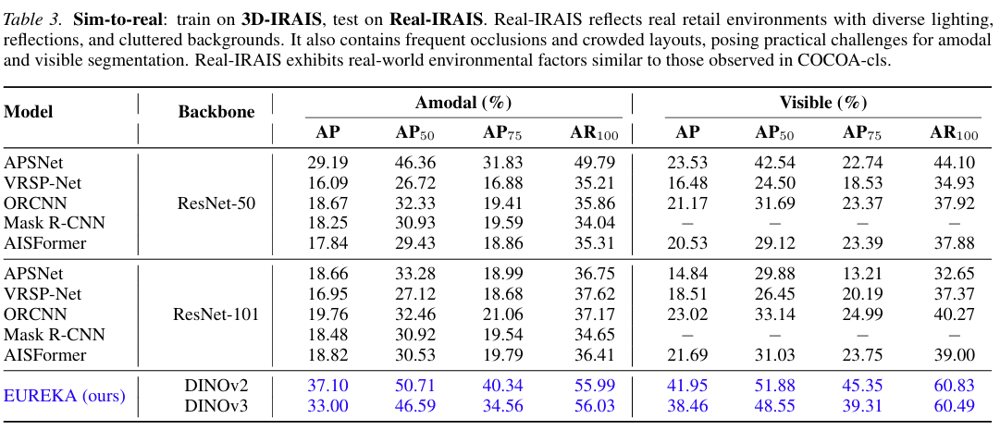
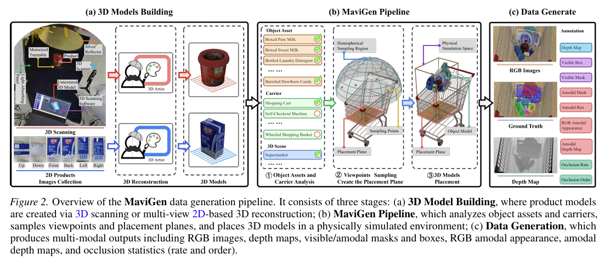
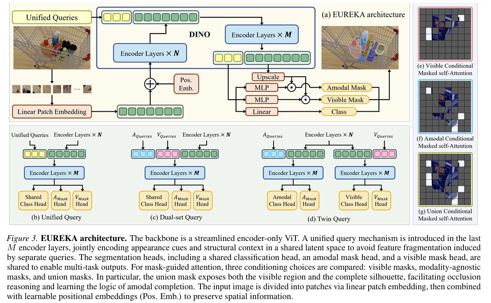

<h1 align="center">
  🎆 Amodal Instance Segmentation with IRAIS:<br/>Sim-to-Real Transfer 🎆
</h1>

<p align="center">
  
  
  
</p>

<p align="center">
  
</p>

<p align="center">
  ✨ <b>Bidong Chen</b>, <b>Lingui Li</b> ✨
</p>

<p align="center">
  <a href="#">
    
  </a>
  &nbsp;
  <a href="#">
    
  </a>
  &nbsp;
  <a href="https://pan.baidu.com/s/17X0xudMqli1AU4AB0pFRCQ?pwd=jwtq">
    
  </a>
  &nbsp;
  <a href="#">
    
  </a>
</p>

---

<!-- <p align="center">
  
  
  
</p> -->


<p align="center">
  
</p>

## 📌 Overview

This repository provides the official implementation of **"Amodal Instance Segmentation with IRAIS Dataset for Sim-to-Real Transfer"** (ICML 2026). We present three core components:

| Component | Description |
|-----------|-------------|
| 🎨 **MaviGen** | Geometry-controllable synthetic data generation engine |
| 📊 **IRAIS** | Large-scale amodal instance segmentation dataset for retail scenes |
| 🤖 **EUREKA** | Unified amodal instance segmentation model |

---

## 🔥 Highlights

<table>
  <tr>
    <td>🏆</td>
    <td><b>State-of-the-art</b> amodal segmentation on multiple AIS benchmarks</td>
  </tr>
  <tr>
    <td>🚀</td>
    <td><b>Zero-shot sim-to-real transfer</b>: Train on synthetic data, deploy on real images</td>
  </tr>
  <tr>
    <td>📦</td>
    <td><b>Rich annotations</b>: Amodal masks, depth, occlusion order, camera parameters</td>
  </tr>
</table>

---

## 📊 Results

### Qualitative Comparison

<p align="center">
  
</p>

### Sim-to-Real Generalization (3D-IRAIS → Real-IRAIS)

<p align="center">
  
</p>

---

## 🛠️ Method

### 🎨 MaviGen: Synthetic Data Generation

<p align="center">
  
</p>

### 🤖 EUREKA: Unified Amodal Segmentation

<p align="center">
  
</p>

---

## 📂 Datase [Coming Soon]  

🔗 **Download**: [Baidu Netdisk](https://pan.baidu.com/s/17X0xudMqli1AU4AB0pFRCQ?pwd=jwtq) (提取码: jwtq)

---

## 📝 Citation

```bibtex
@inproceedings{chen2026amodal,
  title={Amodal Instance Segmentation with IRAIS Dataset for Sim-to-Real Transfer},
  author={Chen, Bidong and Li, Lingui},
  booktitle={ICML},
  year={2026}
}
